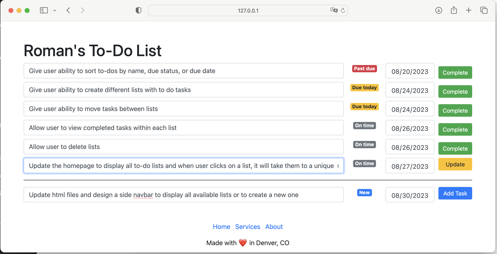

# To-Do App using Python and Flask

## Description
A simple to-do app built with Python using the Flask framework. The app allows users to create, edit, and manage their tasks. This project is part of my capstone project portfolio based on [100 Days of Code: The Complete Python Pro Bootcamp](https://www.udemy.com/course/100-days-of-code/) by Angela Wu.It is designed to showcase my skills in web development using Flask and various other technologies.

Current functionality only allows user to edit tasks in a single master to do list. For future improvements, I'd consider creating a functionality to manage different to do lists (like a traditional Reminders app) and viewing completed tasks. 

## Table of Contents
- [Usage](#usage)
- [Features](#features)
- [Future Improvements](#future-improvements)
- [Technologies Used](#technologies-used)
- [Challenges Faced](#challenges-faced)
- [Contact Information](#contact-information)
- [Acknowledgments](#acknowledgments)
- [Links](#links)

## Usage
1. Run the app: `python main.py`
2. Open a web browser and go to `http://127.0.0.1:5000`
3. Interact with the app to create, edit, and manage your tasks.

## Features
- Create tasks with descriptions and due dates.
- Edit existing task's description and due dates.
- Mark tasks as completed (which will also remove them from your lists).

## Future Improvements
After I tackle a few other projects, I'd consider enhancing the app in the future, including:
- Give user ability to sort to-dos by name, due status, or due date.
- Give user ability to create different lists with to do tasks.
- Give user ability to move tasks between lists.
- Allow user to view completed tasks within each list.
- Allow user to edit and delete lists. 
- Update the homepage to display all to-do lists and when user clicks on a list, it will take them to a unique url with that to do list.
- Adding user authentication for personalized task management.
- Implementing task categorization and filtering.

## Technologies Used
- Python
- Flask
- Pandas
- HTML
- Bootstrap (CSS Framework)